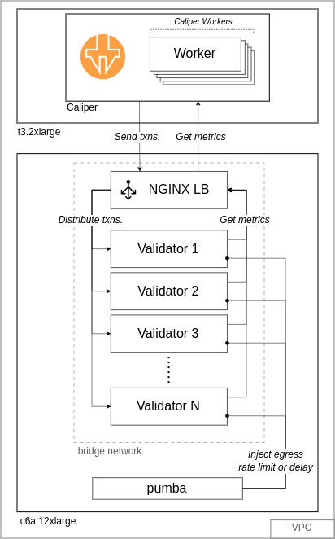

# EmNet: GoQuorum Emulated Network

A collection of supplementary files for the BHS in GoQuorum performance study. Included in this repo are:

- Emulated network generation and experiment-running scripts
    - Built for AWS (see diagram below)
- Results fetching and plotting scripts
- Experiment results (see `data/results/`)

EmNet generates GoQuorum networks for the following setup:



The `caliper` VM runs the benchmarking tool Hyperledger Caliper, which sends transactions to the `network` VM, which runs the Docker emulated network. [`pumba`](https://github.com/alexei-led/pumba) is used to inject egress packet delay and bandwidth limits on each container. An NGINX load-balancer distributes transactions over the emulated network.

## Project Structure

- `data/`: Experiment data and data processing scripts
- `generator/`: Test-generation scripts and output
- `scripts/`: VM installation scripts

## Experiment Data

Experiment results are found in `data/results/`:

```bash
results
├── bl_rate                     # baseline cond. send rate
│   ├── hotstuff_n=16_tps=100
│   │   ├── report_1
│   │   │   ├── params.json
│   │   │   └── report.html
│   │   ├── report_2
│   │   ├── ...
│   │   ├── report_9
│   │   └── report_10
│   ├── hotstuff_n=16_tps=200
│   ├── ...
│   └── plots
├── bl_scale                    # baseline cond. scale
├── bw_200                      # BW-limited cond. at 200 TPS
├── bw_400                      # BW-limited cond. at 400 TPS
├── bw_rate                     # BW-limited cond. send rate
├── bw_scale                    # BW-limited cond. scale
├── delay_rate                  # delay-added cond. send rate
└── delay_scale                 # delay-added cond. scale
```

Each test report contains the ff files:
- `params.json`: Test metadata and passed `.env` parameters to the network
- `report.html`: Test report generated by Caliper; contains all metrics

All `report.html` files are processed by `to_csv.py` before plotting. See `plots.ipynb` for how plots were generated including $\Delta_{BHS}$ calculations. Direct plots of `report.html` metrics are found in the `plots/` subdirectories (see `gen_plots.py` in Usage).

Experiment logs were uploaded to [GDrive](https://drive.google.com/file/d/1LPxNYiM-O6aioQQY8aXARVHLF7OLBAnB/view). [todo: upload to Zenodo]

## Usage

### Installation
1. On the `caliper` VM, run the `install_cal.sh` script
2. On the `network` VM, run the `install_net.sh` script
3. Set `.env` values (see `.env.sample`). Our study used the same `.pem` file for both VMs.
4. [Optional] Setup the data processing scripts (in `data/`) using the ff:

```bash
local:~/emnet$ pip install -r requirements.txt
```

### Running Tests

*Make sure `.env` values are properly set*.

#### 1. Generating Tests

Use `gen_tests.py` to generate multiple tests. Examples below output to `generator/sample_tests`:

```bash
local:~/emnet$ python3 gen_tests.py -t 300 -n 16 -c "2.50" -a "hotstuff" "qbft" -r 5mbit 10mbit 20mbit 50mbit -o sample_tests
```

```bash
local:~/emnet$ python3 gen_tests.py -t 100 200 300 400 -n 4 8 16 -c "2.50" -a "ibft" "qbft" -d 25 50 100 -o sample_tests
```

Generated tests have the ff structure:

```bash
generator/<test_dir_name>/
├── fetch_results.py
├── runner.py
├── hotstuff_n=16_tps=200_net=r10mbit
├── hotstuff...
├── ibft_n=16_tps=200_net=r10mbit
├── ibft...
├── qbft_n=16_tps=200_net=r10mbit
└── qbft...
```

Each test directory (i.e. `hotstuff_n=...`) contains all the necessary files to run alone using the `hotstuff_n=.../test.py` script.

#### 2. Uploading Tests

Run `upload_test.py`:

```bash
local:~/emnet$ python3 upload_test.py -t generator/<test_dir_name>
```

This should upload the test directory to the network VM (i.e. `network:~/<test_dir_name>`).

#### 3. Running Tests

On the network VM, run a `tmux` session in the test directory and run the ff:

```bash
network:~/<test_dir_name>$ python3 runner.py
```

You can optionally append `sudo shutdown -h now` to shutdown the VM after a test.

```bash
network:~/<test_dir_name>$ python3 runner.py; sudo shutdown -h now
```

#### 4. Fetching Results

```bash
local:~/emnet$ python3 get_results.py -t <test_dir_name>
```

Test reports are placed in the `data/` directory. Logs are kept on the network VM (not fetched). 

#### 5. Generating Plots

Process and plot test data by running the ff:

```bash
local:~/emnet/data$ python3 to_csv.py -t <test_dir_name>
local:~/emnet/data$ python3 gen_plots.py -t <test_dir_name> -k <test_type>
```

Where `<test_type>` can be one of: `send_rate`, `scalabiltiy`, and `rate_limit` (BW-limit).

Note that `to_csv.py` skips failed tests.


## Credits

- [ConsenSys Quorum Dev Quickstart](https://github.com/ConsenSys/quorum-dev-quickstart) as our basis for creating a Docker container network
